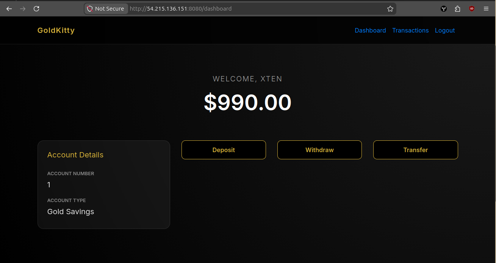
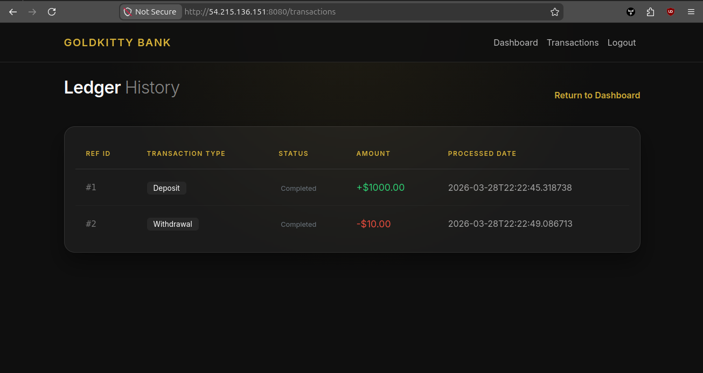
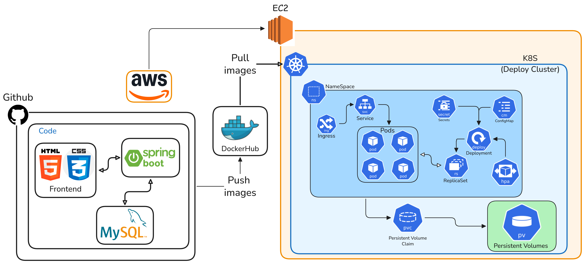

# 3-Tier Bank Application

## Project Overview

This is a 3-tier web-based banking application built with Spring Boot. It provides user registration, authentication, account management, and transaction processing. The application follows a traditional 3-tier architecture with a presentation layer (Thymeleaf templates), application layer (Spring Boot services), and data layer (MySQL database).

The primary use case is to demonstrate a secure, scalable banking system with basic financial operations like deposits, withdrawals, and transfers between accounts.

## Features

- User registration and authentication
- Account balance management
- Deposit and withdrawal operations
- Money transfers between accounts
- Transaction history viewing
- Secure session management with Spring Security
- Responsive web interface

## Tech Stack

### Backend
- Java 17
- Spring Boot 3.3.3 (Web, Security, Data JPA)
- Hibernate ORM
- Thymeleaf templating engine

### Database
- MySQL 8.0

### DevOps
- Docker
- Kubernetes
- Maven for build management

## Prerequisites

- Java 17 or higher
- Maven 3.6+
- Docker 20.10+
- kubectl (for Kubernetes deployment)
- MySQL client (optional, for direct database access)

## Installation & Setup

1. Clone the repository:
   ```bash
   git clone <repository-url>
   cd 3-Tier-Java-MySQL-Docker-main
   ```

2. Ensure Java 17 and Maven are installed:
   ```bash
   java -version
   mvn -version
   ```

3. Build the application:
   ```bash
   mvn clean install
   ```

4. Set up environment variables (see Environment Variables section)

## Environment Variables

Create an `application.properties` file in `src/main/resources/` or set environment variables:

```properties
# Database Configuration
spring.datasource.url=jdbc:mysql://localhost:3306/bankappdb?useSSL=false&serverTimezone=UTC
spring.datasource.username=bankuser
spring.datasource.password=bankpass
spring.datasource.driver-class-name=com.mysql.cj.jdbc.Driver

# JPA Configuration
spring.jpa.hibernate.ddl-auto=update
spring.jpa.properties.hibernate.dialect=org.hibernate.dialect.MySQL8Dialect
spring.jpa.show-sql=true

# Application Configuration
spring.application.name=bankapp
```

For Docker/Kubernetes deployment, use environment variables as shown in `docker-compose.yml` and Kubernetes manifests.

## Running the Project

### Local Development

1. Start MySQL database:
   ```bash
   docker run --name mysql-bank -e MYSQL_ROOT_PASSWORD=Test@123 -e MYSQL_DATABASE=bankappdb -p 3306:3306 -d mysql:8
   ```

2. Run the application:
   ```bash
   mvn spring-boot:run
   ```

3. Access the application at `http://localhost:8080`

### Docker

1. Build and run with Docker Compose:
   ```bash
   docker-compose up --build
   ```

2. Access the application at `http://localhost:8083`

### Kubernetes

1. Apply Kubernetes manifests in order:
   ```bash
   kubectl apply -f k8s/
   ```

2. Get the service URL:
   ```bash
   kubectl get svc -n bankapp
   ```

## Sample Outputs

### Landing Page

Displays welcome message and navigation to login/register.

### Dashboard

Shows account balance and provides forms for:
- Deposit: Enter amount to add to account
- Withdraw: Enter amount to subtract (validates sufficient balance)
- Transfer: Enter recipient username and amount


### Transaction History
Lists all transactions with dates, types, and amounts.

### API Endpoints (Internal)
- `GET /` - Landing page
- `GET /dashboard` - User dashboard
- `POST /register` - User registration
- `POST /deposit` - Deposit money
- `POST /withdraw` - Withdraw money
- `POST /transfer` - Transfer money
- `GET /transactions` - View transaction history

## Workflow


### Development Workflow
1. **Code**: Modify Java classes, templates, or configuration
2. **Build**: Run `mvn clean compile` to compile changes
3. **Test**: Execute `mvn test` for unit tests
4. **Package**: Run `mvn package` to create JAR file
5. **Deploy**: Use Docker or Kubernetes for deployment

## Scaling & Production Notes

### Horizontal Scaling
- Application pods scale via HPA based on CPU utilization
- MySQL uses persistent volume for data persistence
- Load balancing handled by Kubernetes Service

### Production Considerations
- Use external MySQL cluster for high availability
- Implement proper secrets management (not plain text)
- Configure resource limits and requests
- Set up monitoring and logging
- Use HTTPS with proper certificates
- Implement database backups
- Configure proper session management for production

### Security Notes
- Passwords are stored with BCrypt encoding
- CSRF protection enabled
- Session management configured
- Consider adding rate limiting and input validation

## Troubleshooting

### Database Connection Issues
- Verify MySQL is running: `docker ps | grep mysql`
- Check connection string in `application.properties`
- Ensure database exists: `CREATE DATABASE bankappdb;`

### Port Conflicts
- Default ports: App (8080), MySQL (3306)
- Docker Compose uses 8083 for app, 3307 for MySQL
- Check for running processes: `lsof -i :8080`

### Build Failures
- Clear Maven cache: `mvn clean`
- Check Java version: `java -version`
- Verify dependencies: `mvn dependency:tree`

### Kubernetes Issues
- Check pod status: `kubectl get pods -n bankapp`
- View logs: `kubectl logs -n bankapp <pod-name>`
- Describe pod: `kubectl describe pod -n bankapp <pod-name>`

### Common Runtime Errors
- "Table doesn't exist": Run with `spring.jpa.hibernate.ddl-auto=create`
- Authentication failures: Check user credentials in database
- Insufficient balance: Business logic validation in service layer

## Future Improvements

- Add REST API endpoints for mobile app integration
- Implement OAuth2 for third-party authentication
- Add email notifications for transactions
- Implement audit logging
- Add multi-currency support
- Integrate with payment gateways
- Add admin panel for user management